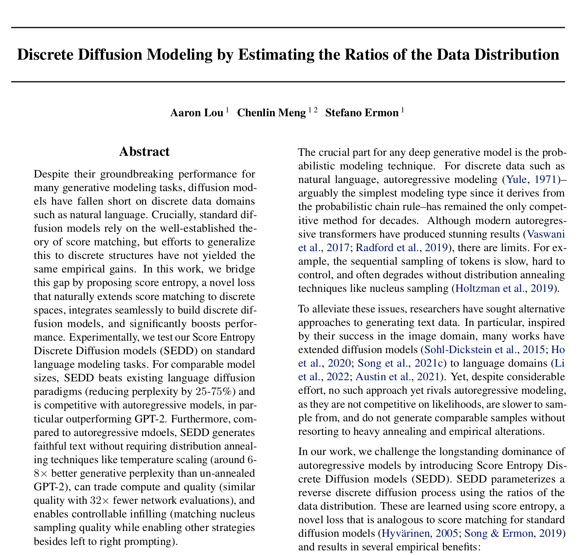

# Unofficial C Implementation of Discrete Diffusion Modelling by Estimating the Ratios of the Data Distribution 
We code, in C, the text diffusion model paper that won ICML 2024. These models demonstrate that denoising each token’s probability vector works better than denoising individual tokens.

This code is written to be followed alongside this [LeetArxiv article](https://leetarxiv.substack.com/p/discrete-diffusion-modelling-by-estimating)

Part 1 and Part 2 handle inference. Part 3 deals with backpropagation.

## Getting Started
1. Download the [Safetensors file from HuggingFace](https://huggingface.co/muragekibicho/DiscreteDiffusionModel/tree/main/converted_safetensors)
2. Create a new folder called `converted_safetensors1 inside the Part1 or Part2 folder and paste the downloaded safetensors.
3. Run using:
- Part 1 (20 seconds/ timestep) : `clear && gcc Safetensor.c Dependencies/cJSON.c -lm -o m.o && ./m.o`
- Part 2 (super fast with BLAS) : `clear && gcc main.c Dependencies/cJSON.c -lm -lopenblas -o m.o && ./m.o
`
